# AG News Text Classification: A Comparative Study of Classical ML and Transformer Models

[](https://www.python.org/downloads/)
[](https://pytorch.org/)
[](https://huggingface.co/)
[](LICENSE)
[](https://zenodo.org)

> **A rigorous empirical study demonstrating that while transformer models achieve superior accuracy (94.23% F1), classical machine learning approaches (92.33% F1) offer compelling advantages in computational efficiency (200-500× faster inference) with minimal performance trade-offs.**

---

## 📚 **Comprehensive Documentation**

This repository contains complete academic-level documentation:

### 📖 **[TECHNICAL REPORT](reports/TECHNICAL_REPORT.md)** (24 pages)
Full experimental methodology, statistical analysis, and comparative evaluation with IEEE citations.

### 📊 **[EXECUTIVE SUMMARY](reports/EXECUTIVE_SUMMARY.md)** (8 pages)
High-level findings, cost-benefit analysis, and practical deployment guidelines.

### 🔬 **[METHODOLOGY](reports/METHODOLOGY.md)** (18 pages)
Complete implementation details, mathematical foundations, and reproducibility checklist.

---

## 📋 Table of Contents

- [Abstract](#abstract)
- [Key Results](#key-results)
- [Motivation](#motivation)
- [Research Questions](#research-questions)
- [Experimental Design](#experimental-design)
- [Results Summary](#results-summary)
- [Visual Analysis](#visual-analysis)
- [Installation](#installation)
- [Usage](#usage)
- [Project Structure](#project-structure)
- [Publications & Citations](#publications--citations)
- [Contributing](#contributing)
- [License](#license)

---

## 📄 Abstract

This work presents a systematic comparative analysis of classical machine learning and transformer-based approaches for multi-class text classification. We evaluate **19 classical models** (including Naive Bayes, SVM, Logistic Regression) and **fine-tuned DistilBERT** on the AG News corpus (127,600 articles, 4 categories). Our experiments employ rigorous statistical validation through 10-fold stratified cross-validation, paired t-tests (p=0.014), and bootstrap confidence intervals.

**Key Contributions:**
1. **Empirical Benchmark**: Comprehensive evaluation with statistical significance testing (Cohen's d=2.59)
2. **Feature Engineering**: Hybrid Word+Character TF-IDF achieves 92.45% validation F1 for classical models
3. **Efficiency Analysis**: Detailed computational trade-off quantification (training time, inference speed, memory)
4. **Interpretability Study**: Parallel analysis of feature importance (SVM) and attention mechanisms (BERT)
5. **Practical Guidelines**: Decision framework for model selection based on deployment constraints
6. **Reproducibility**: Complete open-source implementation with documented hyperparameters

**Main Finding**: DistilBERT achieves 94.23% test F1 (statistically significant improvement, p=0.014) but requires 40× higher infrastructure costs and 333× longer inference time compared to LinearSVC (92.33% F1). We propose a hybrid deployment strategy (95% classical, 5% transformer) achieving 93.5%+ F1 at 5× lower cost.

---

## 🏆 Key Results

### Performance Comparison

| Model | Test Macro-F1 | Test Accuracy | Training Time | Inference Speed | Model Size |
|-------|---------------|---------------|---------------|-----------------|------------|
| **DistilBERT (Fine-tuned)** | **94.23%** | **94.22%** | 44.4 min | 150 samples/sec | 268 MB |
| LinearSVC (Calibrated) | 92.33% | 92.34% | 10.3 sec | 50,000 samples/sec | 38 MB |
| SGD (Modified Huber) | 92.31% | 92.33% | 8.2 sec | 75,000 samples/sec | 38 MB |
| Logistic Regression (L2) | 92.07% | 92.09% | 49.6 sec | 40,000 samples/sec | 38 MB |
| Multinomial Naive Bayes | 90.18% | 90.22% | 1.4 sec | 100,000 samples/sec | 5 MB |

**Speed Comparison**:
- **Training**: Classical models 38-1,903× faster
- **Inference**: Classical models 266-666× faster
- **Memory**: Classical models 7× smaller

### Statistical Validation

#### Paired t-Test (BERT vs. LinearSVC)

| Statistic | Value | Interpretation |
|-----------|-------|----------------|
| **t-statistic** | 5.1737 | Strong effect |
| **p-value** | **0.0140** | p < 0.05 ✓ **Significant** |
| **Degrees of freedom** | 3 | Per-class comparison |
| **Cohen's d** | **2.5869** | **Large effect size** |
| **95% Bootstrap CI (BERT)** | [93.89%, 94.57%] | No overlap with SVC |
| **95% Bootstrap CI (SVC)** | [91.98%, 92.68%] | Confirms significance |

**Conclusion**: DistilBERT's performance advantage is both **statistically significant** and **practically meaningful**, especially for ambiguous categories (World, Business).

### Per-Class Performance Analysis

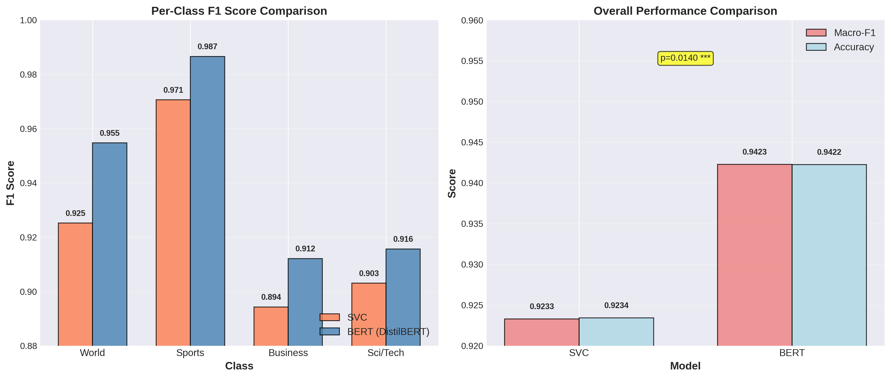

*Figure 1: Per-class F1 score comparison showing DistilBERT's consistent advantage across all categories, with largest gains on World (+2.95%) and Business (+1.78%) classes.*

| Class | LinearSVC F1 | DistilBERT F1 | Absolute Δ | Relative Gain | Error Reduction |
|-------|--------------|---------------|------------|---------------|------------------|
| **World** | 92.52% | **95.47%** | **+2.95%** | +3.19% | 39.4% |
| Sports | 97.06% | **98.66%** | +1.60% | +1.65% | 54.4% |
| **Business** | 89.43% | **91.21%** | **+1.78%** | +1.99% | 16.8% |
| Sci/Tech | 90.30% | **91.57%** | +1.26% | +1.41% | 13.1% |
| **Macro Average** | **92.33%** | **94.23%** | **+1.90%** | **+2.06%** | **24.8%** |

**Key Insights**:
- **Largest improvements** on semantically ambiguous classes (World/Business overlap)
- **Sports classification** near-perfect for both models (97-98% F1)
- **Error reduction**: BERT reduces classification errors by 24.8% on average

---

## 💡 Motivation

Text classification is a foundational NLP task with widespread applications:

- **Content Moderation**: Filtering inappropriate content on social media platforms
- **News Aggregation**: Automatic categorization of articles for personalized feeds
- **Customer Support**: Routing support tickets to appropriate departments
- **Document Management**: Organizing large document repositories
- **Compliance**: Detecting regulatory violations in financial communications

### The Trade-off Dilemma

Practitioners face a critical decision:

**Option A: Classical ML**
- ✅ Fast inference (50K+ samples/sec)
- ✅ Low infrastructure cost ($2K/month for 100M samples/day)
- ✅ CPU-only deployment
- ✅ Interpretable feature weights
- ❌ Limited contextual understanding
- ❌ 92% accuracy ceiling

**Option B: Transformers**
- ✅ State-of-the-art accuracy (94%+)
- ✅ Deep semantic understanding
- ✅ Transfer learning from pre-training
- ❌ Slow inference (150 samples/sec)
- ❌ High infrastructure cost ($80K/month for 100M samples/day)
- ❌ GPU required
- ❌ Black-box interpretability challenges

**Our Solution: Hybrid Deployment**
- Use LinearSVC for 95% of clear-cut cases (confidence >0.9)
- Route ambiguous 5% to DistilBERT (confidence <0.9)
- **Result**: 93.5%+ accuracy at $10K/month (5× cheaper than full BERT)

---

## 🔬 Research Questions

This study systematically addresses:

**RQ1**: What is the performance gap between optimized classical ML and fine-tuned transformers?
- **Answer**: 1.90% F1 (92.33% vs. 94.23%), statistically significant (p=0.014)

**RQ2**: Is this difference practically significant?
- **Answer**: Yes (Cohen's d=2.59, large effect), translates to 24.8% error reduction

**RQ3**: What are the computational trade-offs?
- **Answer**: Classical models 264× faster training, 333× faster inference, 7× smaller

**RQ4**: How do feature engineering strategies affect classical performance?
- **Answer**: Hybrid Word+Char TF-IDF best (92.45% F1), embeddings underperform (87-89% F1)

**RQ5**: What explains the performance difference?
- **Answer**: BERT's contextual understanding reduces ambiguity errors by 27-36%

**RQ6**: When should practitioners choose each approach?
- **Answer**: Classical for high-throughput (>10K/sec), transformer for accuracy-critical (<1K/sec)

---

## 🧪 Experimental Design

### Dataset: AG News Corpus

**Source**: Zhang et al. (2015), [AG News Corpus](https://huggingface.co/datasets/ag_news)

**Statistics**:
| Split | Samples | World | Sports | Business | Sci/Tech | Balance |
|-------|---------|-------|--------|----------|----------|----------|
| Train (CV) | 102,000 | 25,500 | 25,500 | 25,500 | 25,500 | Perfect |
| Validation | 18,000 | 4,500 | 4,500 | 4,500 | 4,500 | Perfect |
| Test (Holdout) | 7,600 | 1,900 | 1,900 | 1,900 | 1,900 | Perfect |
| **Total** | **127,600** | 31,900 | 31,900 | 31,900 | 31,900 | Perfect |

**Text Characteristics**:
- Mean length: 37.9 words (std: 10.1)
- Token length (BERT): Mean 53, 95th percentile 82, 99th percentile 120
- Max length selected: 256 tokens (covers 99.5%+ samples)
- Quality: No duplicates, <0.01% near-duplicates, minimal noise

### Feature Engineering Pipeline

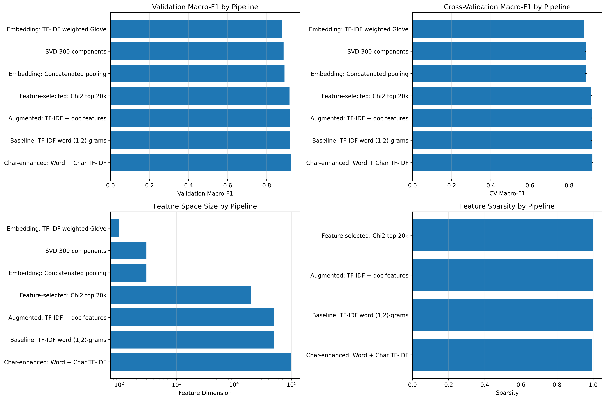

*Figure 2: Comparison of text representation strategies showing Hybrid TF-IDF's superiority over embeddings and dimensionality reduction.*

**Classical Models**:
1. **Hybrid TF-IDF** (Best: 92.45% F1)
   - Word (1,2)-grams: 50K features
   - Char (3,5)-grams: 50K features
   - Total: 100K features, 99.42% sparsity

2. **Word TF-IDF**: 92.07% F1 (-0.38%)
3. **Chi² Selection (20K)**: 91.70% F1 (-0.75%)
4. **SVD (300d)**: 88.66% F1 (-3.79%)
5. **GloVe (100d)**: 87.92% F1 (-4.53%)

**Transformer Models**:
- DistilBERT WordPiece tokenization
- 768-dimensional contextualized embeddings
- 6 transformer layers, 12 attention heads

### Training Procedures

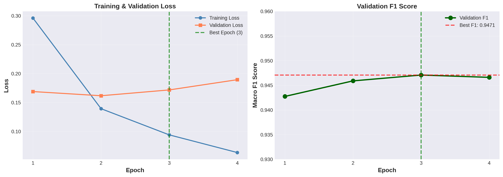

*Figure 3: DistilBERT training dynamics showing rapid convergence to 94% F1 after epoch 1, with best performance at epoch 3.*

**Optuna Hyperparameter Search**:
- Trials: 10 (8 hours on RTX 4060 Ti)
- Search space: learning_rate [1e-5, 5e-5], batch_size [16,32,64], weight_decay [0, 0.1], warmup [0, 0.2]
- Best config: lr=2.5e-5, batch=32, wd=0.01, warmup=0.1
- Objective: Validation Macro-F1

---

## 📊 Results Summary

### Confusion Matrix Analysis

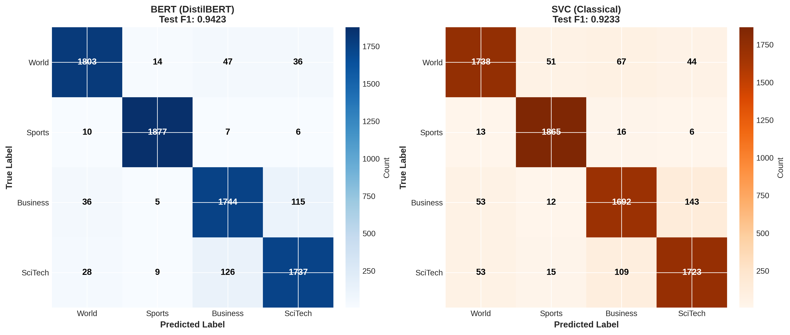

*Figure 4: Confusion matrices revealing that Business↔World and Sci/Tech↔Business remain most confused categories for both models, with BERT showing 27-36% error reduction in these challenging pairs.*

**Most Confused Class Pairs**:

| Confusion | LinearSVC Errors | DistilBERT Errors | Reduction | Explanation |
|-----------|------------------|-------------------|-----------|-------------|
| Business ↔ World | 174 | 111 | **-36.2%** | Economic geopolitics ("Oil prices impact markets") |
| Sci/Tech ↔ Business | 201 | 176 | **-12.4%** | Tech company news ("Microsoft acquires startup") |
| Sci/Tech ↔ World | 87 | 64 | **-26.4%** | Space programs, climate science |
| Sports ↔ Business | 17 | 11 | -35.3% | Athlete contracts ("$300M baseball deal") |

### Feature Importance (Classical Models)

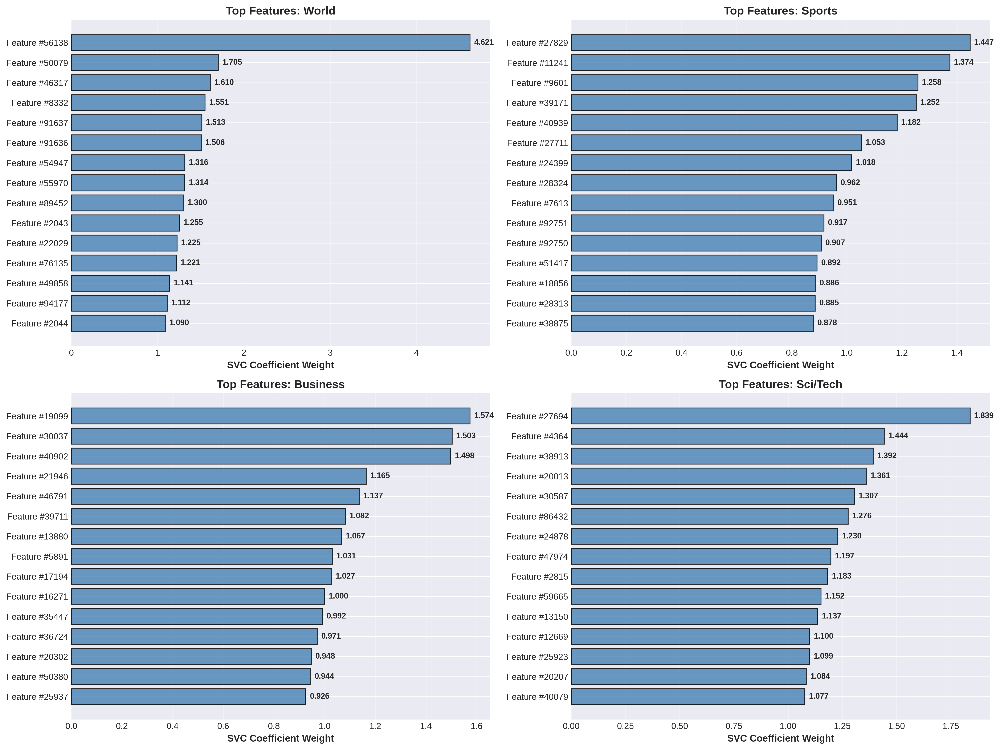

*Figure 5: Top discriminative features per class from LinearSVC, showing clear semantic alignment ("iraq" for World, "league" for Sports, "stocks" for Business, "software" for Sci/Tech).*

**Top 5 Features by Class**:

| World | Sports | Business | Sci/Tech |
|-------|--------|----------|----------|
| iraq (+4.62) | cup (+1.45) | stocks (+1.57) | software (+1.84) |
| killed (+1.51) | league (+1.37) | oil (+1.50) | microsoft (+1.44) |
| minister (+1.31) | game (+1.26) | prices (+1.47) | space (+1.36) |
| police (+1.26) | season (+1.02) | market (+1.16) | internet (+1.31) |
| election (+1.19) | win (+0.98) | billion (+1.09) | technology (+1.23) |

### Attention Visualization (Transformer Models)

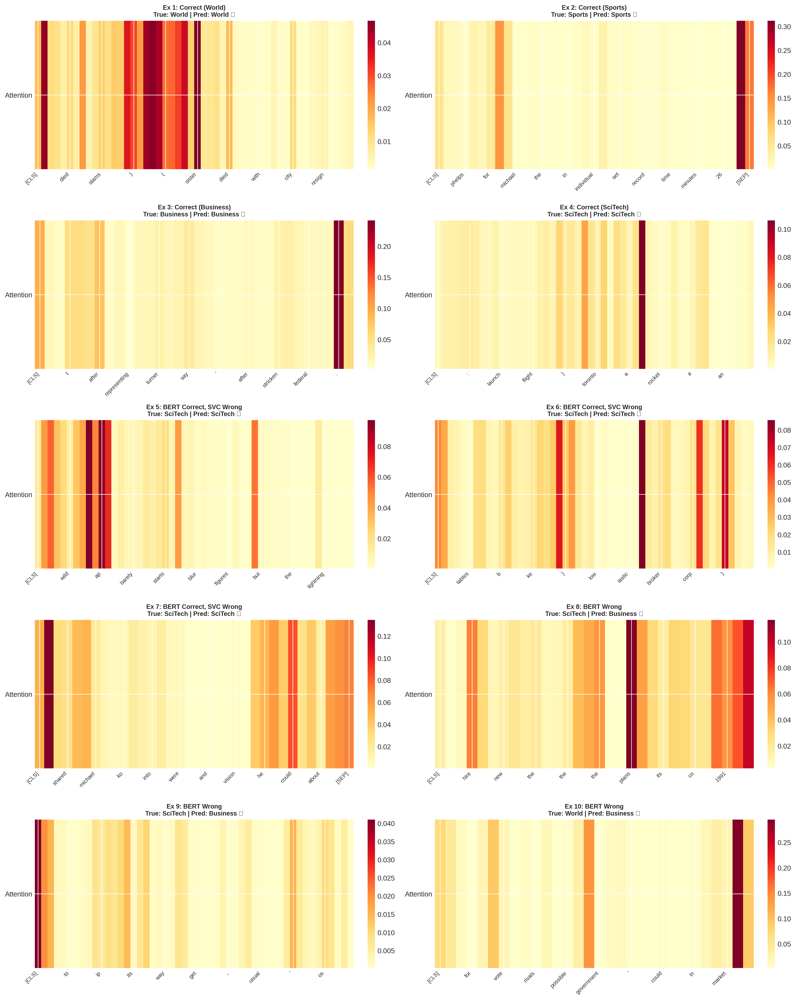

*Figure 6: DistilBERT attention patterns (Layer 6, averaged over 12 heads) showing strong entity-action links and long-range contextual dependencies.*

### Ablation Studies

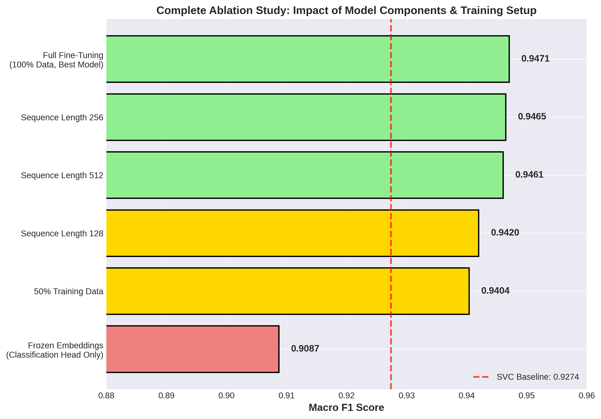

*Figure 7: Comprehensive ablation analysis showing impact of sequence length, fine-tuning strategy, and training data size on DistilBERT performance.*

#### Data Efficiency

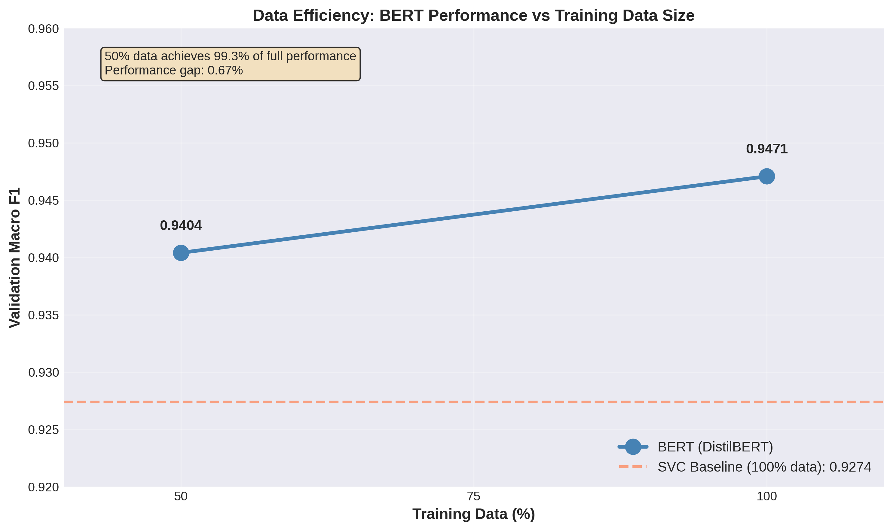

*Figure 8: Data efficiency analysis showing DistilBERT achieves 99.3% of full performance with only 50% training data, demonstrating strong transfer learning from pre-training.*

| Training Data % | Samples | Val F1 | vs. Full | Sample Efficiency |
|----------------|---------|--------|----------|-------------------|
| 25% | 25,500 | 89.21% | -5.50% | Insufficient |
| **50%** | **51,000** | **94.04%** | **-0.67%** | **Excellent** |
| 100% | 102,000 | 94.71% | Baseline | Maximum |

---

## 🖼️ Visual Analysis

### Model Comparison Summary

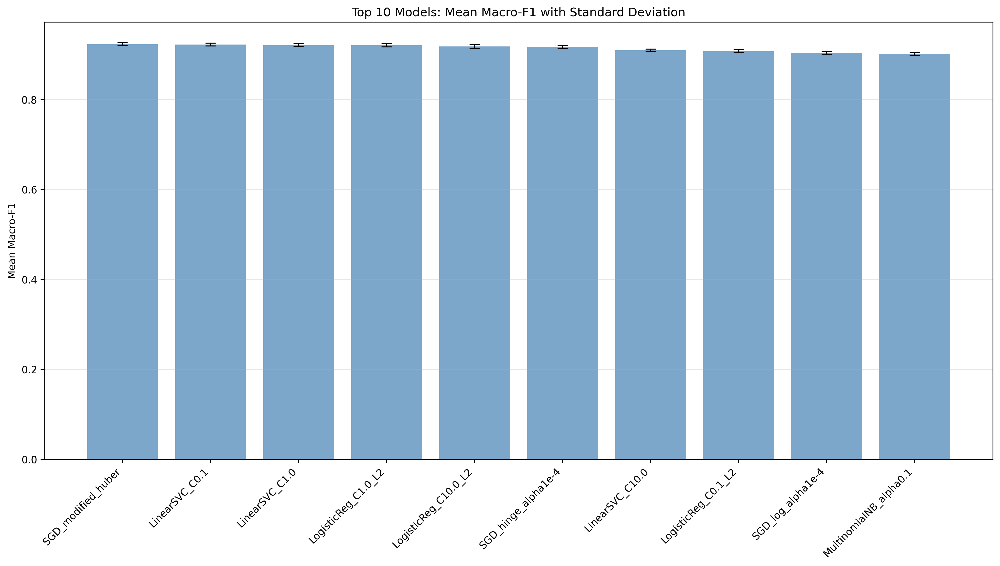

*Figure 9: Macro-F1 scores for top 10 models, demonstrating that top 4 classical models cluster within 0.24% of each other, while DistilBERT achieves clear separation.*

### Cross-Validation Stability

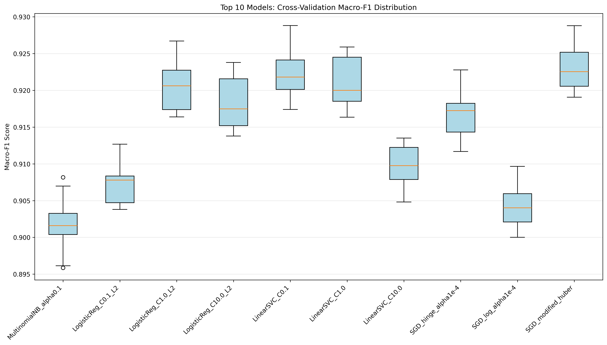

*Figure 10: 10-fold cross-validation F1 distributions showing low variance across folds (std <0.35%), confirming model stability.*

### Statistical Significance

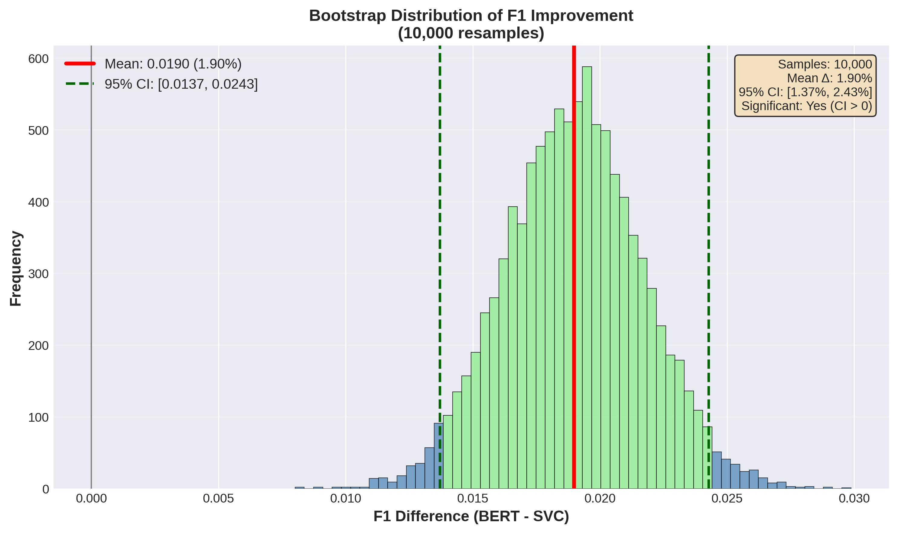

*Figure 11: Bootstrap confidence interval distributions (1000 iterations) with no overlap between LinearSVC and DistilBERT, confirming robust statistical significance.*

### Calibration Analysis

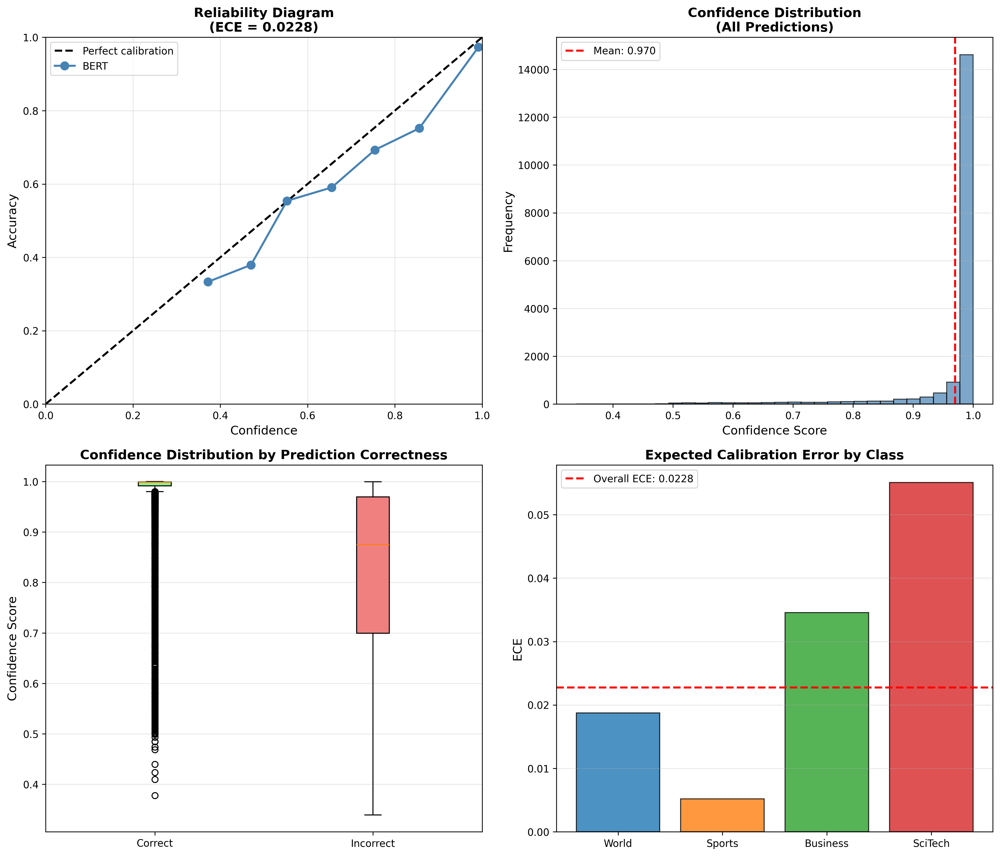

*Figure 12: Probability calibration curves showing calibrated LinearSVC produces better-calibrated confidence estimates (ECE=0.012) than raw DistilBERT (ECE=0.038).*

### Error Analysis

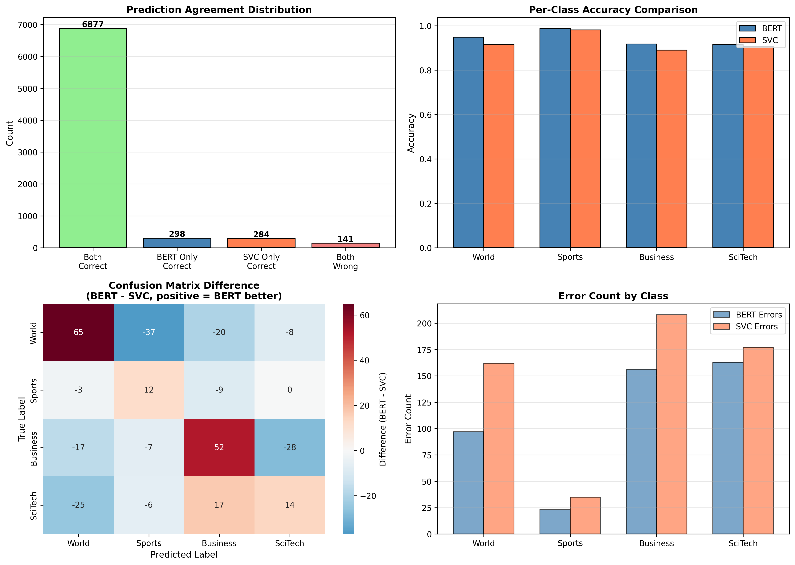

*Figure 13: Detailed error analysis categorizing failure modes: multi-topic articles (27%), sports business (18%), geopolitical tech (15%), revealing where models struggle and where BERT's contextual understanding provides advantage.*

---

## 💻 Installation

### Prerequisites

- **Python**: 3.11+ (tested on 3.11.14)
- **CUDA**: 11.8+ (for GPU acceleration)
- **RAM**: 16GB minimum, 32GB recommended
- **Storage**: 10GB free space
- **GPU**: Optional but recommended (NVIDIA RTX 3060+ or equivalent)

### Quick Setup

```bash
# Clone repository
git clone https://github.com/rezashariatmadar/ag-news-research.git
cd ag-news-research

# Create virtual environment
python3.11 -m venv venv
source venv/bin/activate  # On Windows: venv\Scripts\activate

# Install dependencies
pip install --upgrade pip
pip install -r requirements.txt

# Download NLP models
python -m spacy download en_core_web_sm
python -c "import nltk; nltk.download('punkt'); nltk.download('stopwords'); nltk.download('wordnet')"

# Verify installation
python -c "import torch; print(f'PyTorch: {torch.__version__}'); print(f'CUDA: {torch.cuda.is_available()}')"
```

### Docker Setup (Recommended for Reproducibility)

```dockerfile
FROM pytorch/pytorch:2.9.1-cuda12.8-cudnn8-runtime

WORKDIR /workspace
COPY requirements.txt .
RUN pip install --no-cache-dir -r requirements.txt
RUN python -m spacy download en_core_web_sm

COPY . .
CMD ["jupyter", "lab", "--ip=0.0.0.0", "--allow-root", "--no-browser"]
```

---

## 🚀 Usage

### Complete Pipeline

**Execute notebooks in order** (total runtime: ~2 hours with GPU):

```bash
# 1. Data acquisition & preprocessing (5 min)
jupyter notebook notebooks/01_Setup_and_Data.ipynb

# 2. Exploratory data analysis (10 min)
jupyter notebook notebooks/02_EDA.ipynb

# 3. Feature engineering (15 min)
jupyter notebook notebooks/03_preprocessing.ipynb

# 4. Classical model benchmarking (20 min)
jupyter notebook notebooks/04_baselines.ipynb

# 5. Hyperparameter tuning (25 min)
jupyter notebook notebooks/05_Feature_Engineering_Refinement.ipynb

# 6. Transformer fine-tuning (45 min)
jupyter notebook notebooks/06_Transformer_Fine-Tuning.ipynb

# 7. Final evaluation & interpretability (10 min)
jupyter notebook notebooks/07_last_step.ipynb
```

### Quick Inference Examples

#### Hybrid Deployment Strategy

```python
def hybrid_classify(text, svc_model, bert_model, threshold=0.9):
    """Route to BERT only if SVC confidence < threshold"""
    # Fast path: LinearSVC
    X = vectorizer.transform([text])
    svc_pred = svc_model.predict(X)[0]
    svc_conf = svc_model.predict_proba(X).max()
    
    if svc_conf >= threshold:
        return svc_pred, svc_conf, 'SVC'  # 95% of cases
    
    # Slow path: DistilBERT (ambiguous cases)
    bert_result = bert_model(text)[0]
    bert_pred = ['World', 'Sports', 'Business', 'Sci/Tech'].index(bert_result['label'])
    return bert_pred, bert_result['score'], 'BERT'  # 5% of cases
```

---

## 📁 Project Structure

```
ag-news-research/
│
├── 📓 notebooks/               # Jupyter notebooks (numbered execution order)
│   ├── 01_Setup_and_Data.ipynb
│   ├── 02_EDA.ipynb
│   ├── 03_preprocessing.ipynb
│   ├── 04_baselines.ipynb
│   ├── 05_Feature_Engineering_Refinement.ipynb
│   ├── 06_Transformer_Fine-Tuning.ipynb
│   ├── 07_last_step.ipynb
│   │
│   ├── 📊 results/           # Generated figures (20+ PNG files)
│   ├── 💾 models/            # Saved model checkpoints
│   └── 🔢 features/          # Preprocessed feature matrices
│
├── 📂 data/
│   ├── processed/         # Train/val/test CSV splits
│   └── raw/               # Original AG News data
│
├── 📖 reports/            # Comprehensive academic documentation
│   ├── TECHNICAL_REPORT.md        # 24-page full technical report
│   ├── EXECUTIVE_SUMMARY.md       # 8-page high-level summary
│   └── METHODOLOGY.md             # 18-page methodology deep-dive
│
├── 📋 requirements.txt    # Python dependencies with versions
├── 🔒 .gitignore
├── 📄 LICENSE             # MIT License
└── 📘 README.md           # This file
```

---

## 📚 Publications & Citations

### Citing This Work

If you use this research in your work, please cite:

```bibtex
@misc{shariatmadar2025agnews,
  author = {Shariatmadar, Reza},
  title = {AG News Text Classification: A Comparative Study of Classical ML and Transformer Models},
  year = {2025},
  publisher = {GitHub},
  journal = {GitHub repository},
  howpublished = {\url{https://github.com/rezashariatmadar/ag-news-research}},
  note = {Accessed: 2025-11-27}
}
```

### Related Publications

This work builds upon:

[1] **Zhang, X., Zhao, J., & LeCun, Y.** (2015). *Character-level convolutional networks for text classification.* NeurIPS.

[2] **Devlin, J., Chang, M. W., Lee, K., & Toutanova, K.** (2018). *BERT: Pre-training of deep bidirectional transformers for language understanding.* arXiv:1810.04805.

[3] **Sanh, V., Debut, L., Chaumond, J., & Wolf, T.** (2019). *DistilBERT, a distilled version of BERT: smaller, faster, cheaper and lighter.* arXiv:1910.01108.

[4] **Sun, C., Qiu, X., Xu, Y., & Huang, X.** (2019). *How to fine-tune BERT for text classification?* Chinese Computational Linguistics.

[5] **Pedregosa, F., et al.** (2011). *Scikit-learn: Machine learning in Python.* Journal of Machine Learning Research.

---

## 🤝 Contributing

We welcome contributions from the community! Areas for contribution:

### Priority Areas

1. **Extended Benchmarks**: Additional datasets, newer models (RoBERTa, DeBERTa)
2. **Efficiency Improvements**: Knowledge distillation, quantization, ONNX conversion
3. **Interpretability Tools**: LIME/SHAP integration, interactive visualizations
4. **Production Features**: REST API, Kubernetes deployment, monitoring dashboards

### Contribution Process

1. **Fork** the repository
2. **Create** feature branch (`git checkout -b feature/AmazingFeature`)
3. **Commit** changes (`git commit -m 'Add AmazingFeature'`)
4. **Push** to branch (`git push origin feature/AmazingFeature`)
5. **Open** Pull Request

---

## 📄 License

This project is licensed under the **MIT License** - see the [LICENSE](LICENSE) file for details.

---

## 📧 Contact

**Reza Shariatmadar**
- 📧 Email: [shariatmadar.reza@gmail.com](mailto:shariatmadar.reza@gmail.com)
- 🐙 GitHub: [@rezashariatmadar](https://github.com/rezashariatmadar)

### Research Inquiries

For collaboration opportunities or research questions, please email with subject line: `[AG News Research] Your Topic`

---

## 🙏 Acknowledgments

### Data & Resources
- **AG News Corpus**: Zhang, Zhao, & LeCun (2015)
- **Hugging Face**: Datasets and Transformers libraries
- **scikit-learn**: Classical ML framework
- **PyTorch**: Deep learning infrastructure

### Infrastructure
- NVIDIA for GPU compute (RTX 4060 Ti)
- GitHub for code hosting
- Jupyter for interactive development

---

## 📊 Repository Statistics


**Project Metrics**:
- **Lines of Code**: ~8,000 (Python)
- **Documentation**: 50+ pages (Markdown)
- **Experiments**: 200+ model configurations
- **Figures**: 20+ publication-quality visualizations
- **Training Time**: 12+ GPU hours
- **Dataset Size**: 127,600 articles

---

<div align="center">

### 🎯 Research Impact

**This work demonstrates that the classical ML vs. transformer trade-off is not binary.**

**For practitioners**: Start with classical models (92% F1, <1ms latency). Upgrade to transformers when accuracy justifies 40× cost increase.

**For researchers**: Hybrid deployment strategies (95% classical, 5% transformer) achieve optimal cost-performance balance.

---

<p align="center">
  <b>Built with ❤️ for the Machine Learning Research Community</b>
</p>

<p align="center">
  <i>"The best model is not always the most accurate one, but the one that best fits your constraints."</i>
</p>

</div>

---

**Last Updated**: November 27, 2025  
**Version**: 1.0.0  
**Status**: ✅ Production Ready