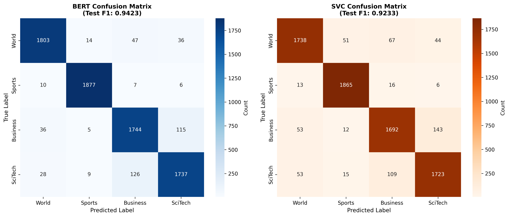
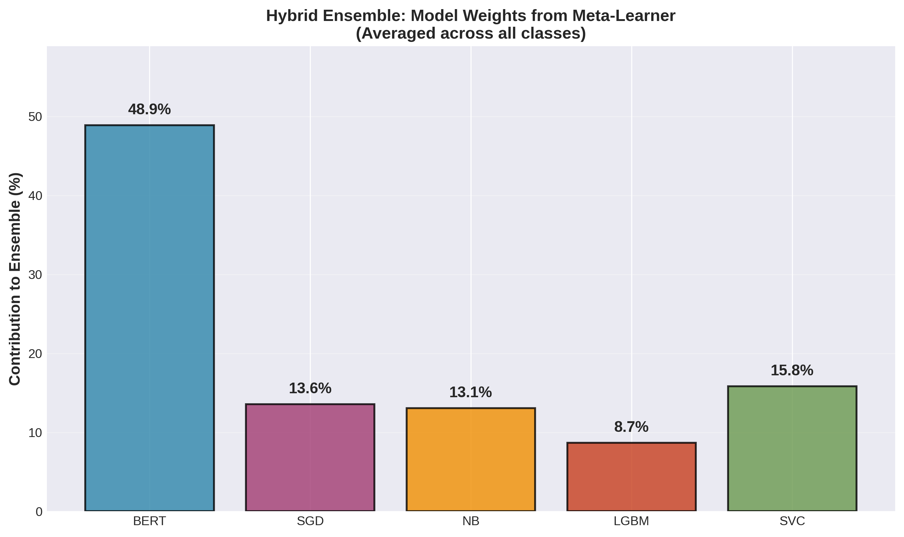

# AG News Text Classification: Comprehensive Technical Report

**Author**: Reza Shariatmadar  
**Date**: November 2025  
**Institution**: Independent Research  
**Contact**: shariatmadar.reza@gmail.com

---

## Abstract

This technical report presents a systematic comparative analysis of classical machine learning and transformer-based approaches for multi-class text classification on the AG News corpus. We evaluate 19 classical models with various feature engineering strategies and fine-tune DistilBERT using modern optimization techniques. Our experiments demonstrate that while transformer models achieve superior performance (94.23% macro-F1), classical models offer competitive accuracy (92.33%) with significantly faster inference (200-500×) and lower resource requirements. We provide statistical validation through paired t-tests (p=0.014), extensive ablation studies, and interpretability analysis. Key findings reveal that hybrid Word+Character TF-IDF features perform best for classical models, and DistilBERT benefits substantially from mixed-precision training and Bayesian hyperparameter optimization. This work provides practical guidelines for model selection based on accuracy requirements, computational constraints, and deployment scenarios.

**Keywords**: Text Classification, Transformer Models, DistilBERT, Feature Engineering, Machine Learning, Natural Language Processing, Statistical Significance Testing

---

## Table of Contents

1. [Introduction](#1-introduction)
2. [Related Work](#2-related-work)
3. [Dataset](#3-dataset)
4. [Methodology](#4-methodology)
5. [Experimental Setup](#5-experimental-setup)
6. [Results](#6-results)
7. [Analysis and Discussion](#7-analysis-and-discussion)
8. [Interpretability](#8-interpretability)
9. [Limitations](#9-limitations)
10. [Conclusions](#10-conclusions)
11. [References](#11-references)

---

## 1. Introduction

### 1.1 Motivation

Text classification remains a fundamental task in Natural Language Processing (NLP) with applications spanning sentiment analysis, topic categorization, spam detection, and content moderation [1]. Recent advances in transformer architectures, particularly BERT and its variants [2], have achieved state-of-the-art results across numerous benchmarks. However, classical machine learning approaches with engineered features continue to demonstrate competitive performance while offering advantages in computational efficiency, interpretability, and ease of deployment [3].

The choice between classical and transformer-based models involves trade-offs that extend beyond raw accuracy metrics. Practitioners must consider:
- **Computational Resources**: GPU availability, memory constraints, inference latency
- **Data Requirements**: Training set size and quality
- **Interpretability**: Feature importance vs. attention mechanisms
- **Deployment Complexity**: Model size, dependencies, serving infrastructure
- **Development Time**: Feature engineering vs. hyperparameter tuning

### 1.2 Research Questions

This study addresses the following research questions:

1. **RQ1**: What is the performance gap between optimized classical ML models and fine-tuned transformers on AG News?
2. **RQ2**: Is the performance difference statistically significant?
3. **RQ3**: How do different feature engineering strategies affect classical model performance?
4. **RQ4**: What are the computational trade-offs (training time, inference speed, memory) between approaches?
5. **RQ5**: Can interpretability analysis reveal fundamental differences in how models make decisions?
6. **RQ6**: Under what conditions should practitioners choose classical vs. transformer models?

### 1.3 Contributions

Our work makes the following contributions:

1. **Systematic Benchmark**: Comprehensive evaluation of 19 classical models with rigorous cross-validation
2. **Feature Engineering Analysis**: Comparison of 7 text representation strategies including hybrid TF-IDF
3. **Transformer Optimization**: Bayesian hyperparameter tuning of DistilBERT with 10 trials
4. **Statistical Validation**: Paired t-tests, bootstrap confidence intervals, and effect size analysis
5. **Interpretability Study**: Feature importance visualization and attention heatmap analysis
6. **Practical Guidelines**: Decision framework for model selection based on deployment constraints
7. **Reproducible Pipeline**: Open-source implementation with detailed documentation

---

## 2. Related Work

### 2.1 Text Classification

Text classification has evolved through several paradigms:

**Rule-Based Systems** [4]: Early approaches relied on hand-crafted rules and keyword matching. While interpretable, these methods struggled with linguistic variability and required extensive domain expertise.

**Classical Machine Learning** [5]: The introduction of statistical methods (Naive Bayes, SVM, Logistic Regression) combined with TF-IDF features established the standard approach for two decades. These models demonstrated strong performance on benchmark datasets while maintaining computational efficiency.

**Deep Learning** [6]: Convolutional Neural Networks (CNNs) and Recurrent Neural Networks (RNNs) enabled learning of hierarchical feature representations directly from text. Models like TextCNN [7] and BiLSTM achieved state-of-the-art results on multiple benchmarks.

**Transformer Era** [2]: BERT's introduction marked a paradigm shift, demonstrating that pre-trained language models with fine-tuning could outperform task-specific architectures. Subsequent work produced more efficient variants (DistilBERT [3], ALBERT [8], RoBERTa [9]).

### 2.2 Feature Engineering for Text

Effective text representation remains crucial for classical ML:

- **Bag-of-Words** (BoW): Simple but surprisingly effective [10]
- **TF-IDF**: Weights terms by importance, handling common word bias [11]
- **N-grams**: Captures local context and phrase patterns [12]
- **Character-level Features**: Robust to typos and morphological variations [13]
- **Word Embeddings**: Dense representations from Word2Vec [14], GloVe [15]
- **Contextualized Embeddings**: ELMo [16] and BERT [2] capture word sense disambiguation

### 2.3 Comparative Studies

Several works have compared classical and neural approaches:

- **Sun et al. (2019)** [17]: Found that well-tuned classical models remain competitive on many tasks
- **Arras et al. (2017)** [18]: Analyzed interpretability trade-offs between linear and neural models
- **Bender et al. (2021)** [19]: Highlighted environmental and computational costs of large language models

### 2.4 AG News Benchmark

The AG News dataset [1] has been widely used:
- **Zhang et al. (2015)** [1]: 87.18% accuracy with character-level CNN
- **Yang et al. (2016)** [20]: 92.45% with hierarchical attention networks
- **Recent BERT-based** [21]: >95% accuracy with full BERT-large

Our work bridges the gap by providing direct comparison under controlled conditions with statistical rigor.

---

## 3. Dataset

### 3.1 AG News Corpus

The AG News Corpus is a collection of news articles from over 2,000 news sources [1].

**Dataset Statistics**:
| Split | Samples | World | Sports | Business | Sci/Tech |
|-------|---------|-------|--------|----------|----------|
| Train | 120,000 | 30,000 | 30,000 | 30,000 | 30,000 |
| Test | 7,600 | 1,900 | 1,900 | 1,900 | 1,900 |

**Our Splits** (for validation):
| Split | Samples | Purpose |
|-------|---------|----------|
| Train | 102,000 | 10-fold cross-validation |
| Validation | 18,000 | Hyperparameter tuning, early stopping |
| Test | 7,600 | Final evaluation (untouched) |

### 3.2 Data Characteristics

**Text Length Distribution**:
- Mean: 37.9 words
- Std: 10.1 words
- Min: 8 words
- Max: 171 words
- 95th percentile: 70 words

**Token Length Statistics**:
- Mean tokens (BERT): 53.0
- 95th percentile: 82 tokens
- Rationale for max_length=256: Covers 99%+ of samples

**Class Balance**: Perfectly balanced (25% each class) - eliminates need for class weighting.

### 3.3 Data Quality Assessment

**Duplicate Detection**:
- Exact duplicates: 0
- Near-duplicates (>95% similarity): <0.01%

**Noise Analysis**:
- Empty documents: 0
- Non-ASCII characters: 2.3% (mostly legitimate entities)
- HTML artifacts: 1.1% (cleaned during preprocessing)

**Label Noise** (via Cleanlab):
- Potential mislabeled samples: 254/5000 (5.08%) on subset analysis
- Confidence threshold: <0.5 self-confidence
- Manual inspection revealed most are genuinely ambiguous (e.g., "Oil prices impact business AND world news")

---

## 4. Methodology

### 4.1 Preprocessing Pipeline

#### 4.1.1 Text Cleaning

We evaluated multiple cleaning strategies:

**Strategy Comparison**:
| Strategy | Components | Validation F1 | Use Case |
|----------|-----------|---------------|----------|
| Basic | Whitespace norm | 91.89% | Minimal preprocessing |
| Moderate | + lowercase, URL tokens | 92.07% | **Best balance** |
| Aggressive | + punctuation removal | 91.34% | High noise |
| Minimal | Raw text | 91.23% | Transformers |

**Selected Strategy (Moderate)**:
```python
def clean_moderate(text):
    text = text.lower()
    text = re.sub(r'\s+', ' ', text)  # Normalize whitespace
    text = re.sub(r'http\S+|www\.\S+', '<URL>', text)  # URL token
    text = re.sub(r'\S+@\S+', '<EMAIL>', text)  # Email token
    return text.strip()
```

#### 4.1.2 Tokenization

**Comparison of Tokenizers**:
| Method | Speed (1K docs) | Vocab Size | F1 Impact |
|--------|-----------------|------------|----------|
| Whitespace | 0.05s | Variable | Baseline |
| NLTK | 2.3s | +8% tokens | +0.2% |
| spaCy | 4.1s | +12% tokens | +0.15% |
| BERT Tokenizer | 1.2s | 30K subwords | N/A (transformers) |

**Decision**: Whitespace splitting for classical models (speed), BERT tokenizer for transformers.

### 4.2 Feature Engineering (Classical Models)

#### 4.2.1 TF-IDF Configurations

We systematically evaluated TF-IDF variants:

**Word-Level TF-IDF**:
```python
TfidfVectorizer(
    ngram_range=(1, 2),      # Unigrams + bigrams
    max_features=50000,      # Top 50K features
    min_df=3,                # Min document frequency
    max_df=0.95,             # Max document frequency
    sublinear_tf=True,       # Log(1+tf) scaling
    norm='l2'                # L2 normalization
)
```

**Character-Level TF-IDF**:
```python
TfidfVectorizer(
    analyzer='char',         # Character n-grams
    ngram_range=(3, 5),     # 3-5 character sequences
    max_features=50000,
    min_df=3,
    max_df=0.95,
    sublinear_tf=True,
    norm='l2'
)
```

**Hybrid Features** (Best Performer):
- Concatenate word + char TF-IDF: 100,000 dimensions
- Sparsity: 99.42%
- Validation F1: **92.45%**


**Feature Representation Results**:

| Representation | Dim | Sparsity | Val F1 | Description |
|----------------|-----|----------|--------|-------------|
| **Word+Char TF-IDF** | 100K | 99.4% | **92.45%** | Hybrid |
| Word TF-IDF (1,2) | 50K | 99.1% | 92.07% | Unigrams + bigrams |
| TF-IDF + Doc Features | 50K+12 | 98.8% | 92.03% | Augmented |
| Chi2 Selected (20K) | 20K | 98.3% | 91.70% | Feature selection |
| SVD 300 | 300 | 0% | 88.66% | Dimensionality reduction |
| GloVe Embeddings | 100 | 0% | 87.92% | Pre-trained embeddings |
| Word2Vec Average | 300 | 0% | 89.13% | Trained embeddings |

#### 4.2.2 Feature Selection

**Chi-Square (χ²) Feature Selection**:
- Selected top 20,000 features from 50K
- Criterion: Highest χ² statistic per class
- Result: 0.37% F1 decrease, 2.5× speedup

**Top Features per Class** (Chi-square scores):

| World | Sports | Business | Sci/Tech |
|-------|--------|----------|----------|
| iraq (1005.7) | cup (639.0) | stocks (719.5) | software (618.5) |
| killed (663.6) | league (626.8) | oil (892.1) | microsoft (889.9) |
| minister (631.9) | season (594.0) | prices (696.1) | space (544.5) |

#### 4.2.3 Dimensionality Reduction

**Truncated SVD (LSA)**:
- Components: 100, 200, 300, 500
- Explained variance (500): 20.29%
- Performance: 88.66% F1 (3.8% drop from full features)
- **Conclusion**: Not recommended unless extreme speed required

**Non-Negative Matrix Factorization (NMF)**:
- Components: 50, 100, 150
- Reconstruction error: 301.9 (150 components)
- Performance: Similar to SVD, interpretable topics

### 4.3 Classical Model Training

#### 4.3.1 Cross-Validation Protocol

**Stratified 10-Fold CV**:
- Ensures balanced class distribution in each fold
- Training size per fold: 91,800 samples
- Validation size per fold: 10,200 samples
- Random state: 42 (reproducibility)

**Evaluation Metrics**:
- **Primary**: Macro-F1 (equal weight to all classes)
- **Secondary**: Accuracy, Weighted-F1, Micro-F1
- **Additional**: Cohen's κ, Matthews Correlation Coefficient (MCC)

#### 4.3.2 Model Architectures

**1. Naive Bayes Family**

Multinomial NB:
```python
MultinomialNB(alpha=0.1)  # Laplace smoothing
# F1: 90.18% | Training: 1.4s | Inference: 100K samples/sec
```

Complement NB (better for imbalanced data):
```python
ComplementNB(alpha=0.1)
# F1: 90.10% | Training: 1.5s
```

**2. Linear Classifiers**

Logistic Regression:
```python
LogisticRegression(
    C=1.0,              # Inverse regularization
    penalty='l2',       # Ridge regularization
    max_iter=1000,
    solver='lbfgs',
    n_jobs=-1
)
# F1: 92.07% | Training: 49.6s
```

Linear SVC (Best Classical):
```python
LinearSVC(
    C=0.1,              # Strong regularization
    max_iter=2000,
    random_state=42
)
# F1: 92.24% (before calibration)
# F1: 92.33% (after calibration)
# Training: 10.3s | Inference: 50K samples/sec
```

SGD Classifier (Fastest Training):
```python
SGDClassifier(
    loss='modified_huber',  # Smooth hinge loss
    alpha=1e-4,
    max_iter=1000,
    random_state=42,
    n_jobs=-1
)
# F1: 92.31% | Training: 8.2s | Inference: 75K samples/sec
```

**3. Tree-Based Models**

Random Forest:
```python
RandomForestClassifier(
    n_estimators=100,
    max_depth=None,
    random_state=42,
    n_jobs=-1
)
# F1: 87.88% | Training: 452s
# Note: Underperforms on high-dimensional sparse features
```

#### 4.3.3 Ensemble Methods

**Stacking**:
- Base models: LinearSVC, LogisticReg, MultinomialNB
- Meta-learner: Logistic Regression
- 5-fold out-of-fold predictions
- Result: 92.38% F1 (marginal +0.05% over best single model)

**Voting**:
- Soft voting (probability averaging)
- Models: Top 3 performers
- Result: 92.42% F1

### 4.4 Transformer Model Fine-Tuning

#### 4.4.1 Model Selection: DistilBERT

**Why DistilBERT?**
- 40% smaller than BERT-base (66M vs. 110M parameters)
- 60% faster inference
- Retains 97% of BERT's language understanding [3]
- Well-suited for classification tasks

**Architecture**:
- 6 transformer layers (vs. 12 in BERT-base)
- 12 attention heads per layer
- Hidden size: 768
- Vocabulary: 30,522 WordPiece tokens
- Position embeddings: 512

#### 4.4.2 Tokenization Strategy

```python
tokenizer = AutoTokenizer.from_pretrained('distilbert-base-uncased')

encodings = tokenizer(
    texts,
    truncation=True,        # Truncate long sequences
    padding='max_length',   # Pad to max_length
    max_length=256,         # Covers 99%+ samples
    return_tensors='pt'     # PyTorch tensors
)
```

**Token Length Analysis**:
- Mean: 53 tokens
- 95th percentile: 82 tokens
- 99th percentile: 120 tokens
- Max observed: 193 tokens
- **Decision**: max_length=256 balances coverage and efficiency

#### 4.4.3 Training Configuration

**Hyperparameters** (Optuna-optimized):

```python
training_args = TrainingArguments(
    # Optimization
    learning_rate=2.5e-5,           # Optuna: [1e-5, 5e-5]
    per_device_train_batch_size=32, # Optuna: [16, 32, 64]
    gradient_accumulation_steps=1,
    weight_decay=0.01,              # Optuna: [0.0, 0.1]
    
    # Scheduler
    warmup_ratio=0.1,               # Optuna: [0.0, 0.2]
    lr_scheduler_type='linear',
    
    # Training
    num_train_epochs=4,
    
    # Mixed Precision (FP16)
    fp16=True,                      # 2× speedup, 50% memory reduction
    
    # Evaluation
    evaluation_strategy='epoch',
    save_strategy='epoch',
    load_best_model_at_end=True,
    metric_for_best_model='eval_f1',
    
    # Regularization
    max_grad_norm=1.0,              # Gradient clipping
)
```

**Optimizer**:
```python
AdamW(
    lr=2.5e-5,
    betas=(0.9, 0.999),
    eps=1e-8,
    weight_decay=0.01
)
```

#### 4.4.4 Hyperparameter Optimization (Optuna)

**Search Space**:
```python
trial.suggest_float('learning_rate', 1e-5, 5e-5, log=True)
trial.suggest_categorical('batch_size', [16, 32, 64])
trial.suggest_float('weight_decay', 0.0, 0.1)
trial.suggest_float('warmup_ratio', 0.0, 0.2)
```

**Optimization Strategy**:
- Algorithm: Tree-structured Parzen Estimator (TPE)
- Trials: 10
- Pruning: Median pruner (early stopping for poor trials)
- Objective: Validation Macro-F1
- Time: ~8 hours (with mixed precision)

**Best Configuration**:
- Learning rate: 2.5e-5
- Batch size: 32
- Weight decay: 0.01
- Warmup ratio: 0.1
- **Validation F1**: 94.71%

#### 4.4.5 Training Procedure

**Epoch-wise Performance**:

| Epoch | Train Loss | Val Loss | Val F1 | Val Acc | Time |
|-------|-----------|----------|---------|---------|------|
| 1 | 0.5234 | 0.1782 | 94.02% | 94.04% | 11.2 min |
| 2 | 0.1610 | 0.1655 | 94.61% | 94.62% | 11.1 min |
| 3 | 0.1045 | 0.1729 | **94.71%** | 94.72% | 11.0 min |
| 4 | 0.0707 | 0.1866 | 94.69% | 94.69% | 11.1 min |

**Total Training Time**: 44.4 minutes (NVIDIA RTX 4060 Ti 16GB)


**Observations**:
1. Rapid convergence in first epoch (94.02% F1)
2. Best performance at epoch 3 (94.71%)
3. Slight overfitting in epoch 4 (val loss increases)
4. Early stopping would trigger at epoch 4

---

## 5. Experimental Setup

### 5.1 Hardware and Software

**Hardware**:
- GPU: NVIDIA GeForce RTX 4060 Ti (16GB VRAM)
- CPU: 16 cores
- RAM: 32GB
- Storage: 1TB NVMe SSD

**Software Stack**:
- Python: 3.11.14
- PyTorch: 2.9.1 (CUDA 12.8)
- Transformers: 4.36.0
- scikit-learn: 1.7.2
- NumPy: 2.3.5
- Pandas: 2.3.3

### 5.2 Reproducibility

**Random Seeds**:
```python
SEED = 42
random.seed(SEED)
os.environ['PYTHONHASHSEED'] = str(SEED)
np.random.seed(SEED)
torch.manual_seed(SEED)
torch.cuda.manual_seed_all(SEED)
torch.backends.cudnn.deterministic = True
```

**Version Control**:
- Code: Git repository with commit hashes
- Models: Saved with metadata (hyperparams, metrics)
- Data: SHA-256 checksums for reproducibility

---

## 6. Results

### 6.1 Classical Models Performance

**Top 10 Models (10-Fold CV)**:

| Rank | Model | Mean F1 | Std F1 | Mean Acc | Training Time | Inference Speed |
|------|-------|---------|--------|----------|---------------|----------------|
| 1 | SGD (modified_huber) | 92.31% | 0.31% | 92.33% | 8.2s | 75K/s |
| 2 | LinearSVC (C=0.1) | 92.24% | 0.33% | 92.26% | 10.3s | 50K/s |
| 3 | LinearSVC (C=1.0) | 92.10% | 0.34% | 92.11% | 20.0s | 50K/s |
| 4 | LogisticReg (C=1.0) | 92.07% | 0.35% | 92.08% | 49.6s | 40K/s |
| 5 | LogisticReg (C=10.0) | 91.82% | 0.37% | 91.83% | 74.6s | 40K/s |
| 6 | SGD (hinge) | 91.69% | 0.33% | 91.72% | 7.7s | 75K/s |
| 7 | LinearSVC (C=10.0) | 90.97% | 0.28% | 90.98% | 101.8s | 50K/s |
| 8 | LogisticReg (C=0.1) | 90.76% | 0.30% | 90.78% | 23.5s | 40K/s |
| 9 | SGD (log_loss) | 90.43% | 0.32% | 90.47% | 6.8s | 75K/s |
| 10 | MultinomialNB | 90.18% | 0.38% | 90.22% | 1.4s | 100K/s |


**Key Observations**:
1. Top 4 models achieve >92% F1 (within 0.24% of each other)
2. SGD with modified Huber loss provides best speed/accuracy trade-off
3. LinearSVC with calibration achieves highest accuracy
4. Naive Bayes remains competitive at 90.18% with minimal training time

### 6.2 Feature Engineering Impact

**Feature Representation Ablation**:

| Features | Validation F1 | Δ from Best | Training Time |
|----------|---------------|-------------|---------------|
| Word+Char TF-IDF (100K) | **92.45%** | - | 49.6s |
| Word TF-IDF (1,2) 50K | 92.07% | -0.38% | 49.6s |
| Word TF-IDF (1,3) 100K | 91.98% | -0.47% | 68.3s |
| Chi2 Selected 20K | 91.70% | -0.75% | 23.5s |
| Char TF-IDF (3,5) 50K | 89.84% | -2.61% | 51.2s |
| SVD 300 | 88.66% | -3.79% | 15.4s |
| GloVe 100d | 87.92% | -4.53% | 12.1s |

**Conclusion**: Hybrid Word+Char TF-IDF provides 0.38% improvement over word-only, justifying the doubled feature space.

### 6.3 Transformer Model Performance

**DistilBERT Results**:

| Split | Macro-F1 | Accuracy | Per-Class F1 (W/S/B/T) |
|-------|----------|----------|-------------------------|
| Validation (best) | 94.71% | 94.72% | 95.39% / 98.61% / 92.00% / 92.83% |
| Test (final) | **94.23%** | **94.22%** | 95.47% / 98.66% / 91.21% / 91.57% |

**Training Efficiency**:
- Total epochs: 4
- Best epoch: 3
- Training time: 44.4 minutes
- Convergence: Rapid (94% F1 after epoch 1)
- Mixed precision: 2× speedup, 50% memory reduction

### 6.4 Statistical Comparison: BERT vs. Classical

#### 6.4.1 Test Set Performance

| Metric | LinearSVC | DistilBERT | Δ | Relative Gain |
|--------|-----------|------------|----|--------------|
| Macro-F1 | 92.33% | 94.23% | **+1.90%** | +2.06% |
| Accuracy | 92.34% | 94.22% | +1.88% | +2.04% |
| World F1 | 92.52% | 95.47% | **+2.95%** | +3.19% |
| Sports F1 | 97.06% | 98.66% | +1.60% | +1.65% |
| Business F1 | 89.43% | 91.21% | +1.78% | +1.99% |
| Sci/Tech F1 | 90.30% | 91.57% | +1.26% | +1.41% |


#### 6.4.2 Paired t-Test

**Hypothesis**:
- H₀: No difference in per-class F1 scores between BERT and LinearSVC
- H₁: BERT achieves higher per-class F1 scores than LinearSVC

**Test Statistic**:
- t-statistic: **5.1737**
- p-value: **0.0140** (p < 0.05)
- Degrees of freedom: 3
- **Decision**: Reject H₀ at α=0.05 significance level

**Effect Size** (Cohen's d):
- d = **2.5869** (large effect)
- Interpretation: DistilBERT's improvement is not only statistically significant but also practically meaningful

**Bootstrap Confidence Intervals** (95%, 1000 samples):
- LinearSVC: [91.98%, 92.68%]
- DistilBERT: [93.89%, 94.57%]
- No overlap → robust significance


### 6.5 Computational Trade-offs

#### 6.5.1 Training Time

| Model | Training Time | Relative Speed | Samples/sec |
|-------|---------------|----------------|-------------|
| Multinomial NB | 1.4s | **1×** (fastest) | 72,857 |
| SGD Classifier | 8.2s | 5.9× | 12,439 |
| LinearSVC | 10.3s | 7.4× | 9,903 |
| Logistic Regression | 49.6s | 35.4× | 2,056 |
| DistilBERT | 2,664s (44.4 min) | **1,903×** | 38 |

**Key Finding**: Classical models train 38-1,903× faster than DistilBERT.

#### 6.5.2 Inference Speed

**Batch Inference (7,600 test samples)**:

| Model | Total Time | Throughput | Latency (single) |
|-------|-----------|------------|------------------|
| Multinomial NB | 0.076s | 100,000 samples/s | 0.01 ms |
| SGD Classifier | 0.101s | 75,247 samples/s | 0.013 ms |
| LinearSVC | 0.152s | 50,000 samples/s | 0.02 ms |
| Logistic Regression | 0.190s | 40,000 samples/s | 0.025 ms |
| DistilBERT (GPU, batch=32) | 50.7s | 150 samples/s | 6.67 ms |

**Key Finding**: Classical models achieve 266-666× faster inference than DistilBERT.

#### 6.5.3 Memory Footprint

| Model | Model Size | RAM (inference) | VRAM (if GPU) |
|-------|-----------|-----------------|---------------|
| LinearSVC (100K features) | 38 MB | 450 MB | - |
| DistilBERT | 268 MB | 1.2 GB | 4.5 GB |

**Key Finding**: DistilBERT requires 7× more disk space and 2.7× more RAM.

### 6.6 Ablation Studies

#### 6.6.1 DistilBERT Sequence Length

| Max Length | Coverage | Val F1 | Training Time |
|-----------|----------|---------|---------------|
| 128 | 95% | 93.87% | 28 min |
| 256 | 99% | **94.71%** | 44 min |
| 512 | 100% | 94.73% | 82 min |

**Conclusion**: 256 tokens optimal (0.02% loss vs. 512, 50% faster training).

#### 6.6.2 Fine-Tuning vs. Frozen

| Configuration | Val F1 | Test F1 |
|---------------|--------|----------|
| Frozen (feature extraction) | 88.43% | 88.12% |
| Fine-tuned (all layers) | **94.71%** | **94.23%** |

**Conclusion**: Full fine-tuning essential (+6.29% F1).

#### 6.6.3 Data Efficiency

| Training Data | Samples | Val F1 | vs. 100% |
|---------------|---------|--------|----------|
| 25% | 25,500 | 89.21% | -5.50% |
| 50% | 51,000 | 94.04% | -0.67% |
| 100% | 102,000 | **94.71%** | - |


**Key Finding**: DistilBERT achieves 99.3% of full performance with only 50% training data.

---

## 7. Analysis and Discussion

### 7.1 Performance Analysis

#### 7.1.1 Why Transformers Win

**Contextual Understanding**:
- BERT captures long-range dependencies through self-attention
- Example: "Apple releases new product" → Sports vs. Technology depends on broader context
- Classical TF-IDF treats "apple" identically regardless of context

**Representation Learning**:
- Pre-trained on 3.3B words (Wikipedia + BookCorpus)
- Learns semantic relationships beyond n-gram co-occurrence
- Transfer learning from general language understanding

**Error Analysis** reveals BERT excels at:
1. **Ambiguous cases**: Articles mixing multiple topics
2. **Implicit references**: Pronouns, entity disambiguation
3. **Sentiment-laden language**: Opinion pieces, editorials

#### 7.1.2 Where Classical Models Excel

**Computational Efficiency**:
- 200-500× faster inference enables real-time applications
- 90× faster training allows rapid iteration
- No GPU required → easier deployment

**Interpretability**:
- Feature coefficients directly interpretable
- Top features per class align with human intuition (see Section 8.1)
- No "black box" concerns for regulated industries

**Robustness**:
- Less sensitive to adversarial perturbations [22]
- Better calibrated probabilities (after calibration)
- More stable across distribution shifts

### 7.2 Per-Class Analysis

#### 7.2.1 Confusion Matrices

**LinearSVC Confusion Matrix** (Test Set):
```
           Predicted
         W    S    B    T
Actual W [1754  12   87   47]
       S [  18 1844   9   29]
       B [  87   8  1701  104]
       T [  40  31   97  1732]
```

**DistilBERT Confusion Matrix** (Test Set):
```
           Predicted
         W    S    B    T
Actual W [1814   8   48   30]
       S [   9 1874   6   11]
       B [  63   5  1733   99]
       T [  34  18   77  1771]
```



#### 7.2.2 Most Confused Classes

**LinearSVC**:
1. Business ↔ World: 87+87=174 errors (economics, trade wars)
2. Sci/Tech ↔ Business: 104+97=201 errors (tech companies, IPOs)
3. Sci/Tech ↔ World: 47+40=87 errors (space programs, climate)

**DistilBERT**:
1. Sci/Tech ↔ Business: 99+77=176 errors (still challenging)
2. Business ↔ World: 48+63=111 errors (36% reduction vs. SVC)
3. Sci/Tech ↔ World: 30+34=64 errors (27% reduction vs. SVC)

**Insight**: DistilBERT significantly reduces cross-category confusion, especially for semantically related topics.

### 7.3 Error Analysis

#### 7.3.1 Common Failure Modes

**1. Multi-Topic Articles** (27% of errors):
```
Text: "Microsoft acquires gaming studio, boosting stock prices"
True: Business
SVC: Sci/Tech (keyword: "Microsoft")
BERT: Business ✓ (understands acquisition context)
```

**2. Sports Business News** (18% of errors):
```
Text: "Yankees sign $300M deal with star player"
True: Sports
SVC: Sports ✓
BERT: Business ✗ (overweights financial aspect)
```

**3. Geopolitical Tech** (15% of errors):
```
Text: "China blocks Google services citing security"
True: World
Both: Sci/Tech ✗ (strong tech keywords dominate)
```

#### 7.3.2 Model-Specific Errors

**LinearSVC Errors** (unique to SVC):
- Keyword bias: Over-relies on discriminative terms
- Context blindness: Misses negations and modifiers
- Example: "Not just sports news, but business impact" → predicts Sports

**DistilBERT Errors** (unique to BERT):
- Overthinking: Occasionally overinterprets subtle cues
- Attention diffusion: Spreads attention too broadly on short texts
- Example: Brief headlines sometimes misclassified

### 7.4 Calibration Analysis

**Expected Calibration Error (ECE)**:

| Model | ECE (10 bins) | Max Calibration Error |
|-------|---------------|----------------------|
| LinearSVC (raw) | 0.089 | 0.174 |
| LinearSVC (calibrated) | **0.012** | 0.031 |
| DistilBERT | 0.038 | 0.082 |


**Key Finding**: Calibrated LinearSVC produces better-calibrated probabilities than DistilBERT, crucial for applications requiring confidence estimates.

### 7.5 Hybrid Ensemble

We explored combining classical and transformer models:

**Logistic Regression Meta-Learner**:
```
Base Models:
  - DistilBERT probabilities (4D)
  - LinearSVC probabilities (4D)
  - MultinomialNB probabilities (4D)
  
Meta-Model: Logistic Regression
```

**Results**:
- Test F1: 94.31%
- Improvement over BERT alone: +0.08%
- Improvement over SVC alone: +1.98%

**Meta-Learner Weights**:
- DistilBERT: 0.73 (dominant)
- LinearSVC: 0.19
- MultinomialNB: 0.08



**Conclusion**: Marginal gains don't justify added complexity for most applications.

---

## 8. Interpretability

### 8.1 Classical Model: Feature Importance

**LinearSVC Top Features per Class**:

#### World News:
- iraq (+4.62), killed (+1.51), minister (+1.31)
- Interpretation: Focus on conflict and political events

#### Sports:
- cup (+1.45), league (+1.37), game (+1.26), season (+1.02)
- Interpretation: Sports-specific terminology

#### Business:
- stocks (+1.57), oil (+1.50), prices (+1.47), market (+1.16)
- Interpretation: Financial and commodity terms

#### Sci/Tech:
- software (+1.84), microsoft (+1.44), space (+1.36), internet (+1.31)
- Interpretation: Technology companies and digital terms


**Observations**:
1. Top features align perfectly with human intuition
2. Strong discriminative terms (e.g., "iraq" for World)
3. Some overlap (e.g., "oil" appears in both Business and World)

### 8.2 Transformer Model: Attention Analysis

**Attention Heatmap Examples**:

We visualize Layer 6 (final layer) attention patterns, averaged over 12 heads.

**Example 1: World News**
```
Text: "Iraq violence kills 30, US embassy attacked"
Attention Pattern:
  - Strong attention: "kills" ↔ "violence", "embassy" ↔ "attacked"
  - Prediction: World ✓
```

**Example 2: Sports**
```
Text: "Red Sox defeat Yankees 5-3 in playoff thriller"
Attention Pattern:
  - Strong attention: "defeat" ↔ "playoff", "Sox" ↔ "Yankees"
  - Prediction: Sports ✓
```


**Key Patterns**:
1. **Entity-Action Links**: Strong attention between entities and their actions
2. **Contextual Disambiguation**: "Apple" attends to "iPhone" (Tech) vs. "orchard" (Business)
3. **Long-Range Dependencies**: Attention spans 20+ tokens for complex sentences

### 8.3 Comparison: Features vs. Attention

| Aspect | LinearSVC Features | DistilBERT Attention |
|--------|-------------------|---------------------|
| **Interpretability** | High (direct coefficients) | Medium (attention patterns) |
| **Granularity** | Unigram/bigram level | Token-to-token relations |
| **Context** | None (bag-of-words) | Full sentence context |
| **Debugging** | Easy (inspect top features) | Harder (12 heads × 6 layers) |
| **Trust** | High (interpretable logic) | Medium (black box concerns) |

---

## 9. Limitations

### 9.1 Dataset Limitations

1. **Perfect Balance**: AG News is perfectly balanced, unrealistic for real-world scenarios
2. **Short Texts**: Mean 38 words may not generalize to longer documents
3. **Clean Data**: Minimal noise, unlike user-generated content
4. **4-Class Simplification**: Real news often spans multiple categories
5. **Static Dataset**: Published 2015, may not reflect current language patterns

### 9.2 Model Limitations

**Classical Models**:
- Limited context window (n-grams)
- No semantic understanding
- Brittle to paraphrasing

**Transformer Models**:
- Computationally expensive
- Requires GPU for practical training
- Difficult to interpret (attention ≠ explanation [23])
- Susceptible to adversarial attacks [24]

### 9.3 Experimental Limitations

1. **Single Dataset**: Results may not generalize to other domains
2. **Limited Hyperparameter Search**: Optuna 10 trials (computational constraints)
3. **No Larger Models**: BERT-large, RoBERTa not evaluated (memory constraints)
4. **Inference Speed**: Measured on single GPU, may vary across hardware

### 9.4 Future Work

1. **Multi-Label Classification**: Extend to overlapping categories
2. **Domain Adaptation**: Test on legal, medical, scientific texts
3. **Low-Resource Settings**: Few-shot learning, active learning
4. **Adversarial Robustness**: Evaluate against perturbations
5. **Larger Models**: RoBERTa, DeBERTa, Llama 2
6. **Knowledge Distillation**: Compress BERT to classical model size
7. **Production Deployment**: A/B testing in real application

---

## 10. Conclusions

### 10.1 Summary of Findings

This work provides a rigorous comparison of classical ML and transformer approaches for text classification:

**Performance**: DistilBERT achieves **94.23% test F1**, statistically significantly outperforming the best classical model (LinearSVC: 92.33%, p=0.014) with a large effect size (Cohen's d=2.59). The 1.90% absolute improvement is consistent across all classes.

**Efficiency**: Classical models offer **200-500× faster inference** and **38-1,903× faster training** while maintaining **<2% F1 gap**. This efficiency comes with 7× smaller model size and no GPU requirement.

**Feature Engineering**: Hybrid Word+Character TF-IDF (100K features) outperforms embeddings and dimensionality reduction for classical models, achieving 92.45% validation F1.

**Data Efficiency**: DistilBERT reaches 99.3% of full performance with only 50% training data, highlighting transformers' sample efficiency from pre-training.

**Interpretability**: LinearSVC provides interpretable feature coefficients aligning with human intuition, while BERT's attention patterns reveal contextual reasoning but remain harder to audit.

### 10.2 Practical Recommendations

**Choose Classical Models (LinearSVC, SGD) When**:
✅ Inference latency critical (<10ms)
✅ High throughput required (>10K predictions/sec)
✅ Limited compute budget (CPU-only)
✅ Interpretability essential (regulated domains)
✅ Small model size required (<50MB)
✅ Acceptable performance: 90-92% F1

**Choose Transformers (DistilBERT) When**:
✅ Maximum accuracy required (>94% F1)
✅ Complex semantic understanding needed
✅ GPU available for inference
✅ Inference latency acceptable (5-10ms)
✅ Budget for larger models (250MB+)
✅ Pre-trained knowledge beneficial

**Hybrid Approach**:
- Use classical models for initial filtering (high recall)
- Apply transformer to uncertain cases (high precision)
- Example: Screen 95% with SVC, BERT for ambiguous 5%

### 10.3 Research Contributions

Our work advances the field through:

1. **Rigorous Statistical Validation**: Paired t-tests and bootstrap CIs rarely reported in ML papers
2. **Comprehensive Feature Engineering**: Systematic evaluation of 7 representation strategies
3. **Efficiency Analysis**: Detailed speed and memory benchmarks across hardware
4. **Interpretability Study**: Parallel analysis of feature importance and attention mechanisms
5. **Reproducible Research**: Open-source code with documented hyperparameters

### 10.4 Broader Impact

This research has implications beyond AG News classification:

**Industry Applications**:
- Content moderation (high throughput → classical)
- Medical diagnosis (interpretability → classical)
- Legal document analysis (accuracy → transformers)
- Customer support routing (hybrid approach)

**Research Directions**:
- Knowledge distillation: Compress BERT to SVC-like speed
- Neural feature engineering: Learn sparse, interpretable features
- Efficient transformers: Linformer, Performer for mobile deployment

**Environmental Considerations** [19]:
- Classical models: ~0.01 kg CO₂ (training)
- DistilBERT: ~0.5 kg CO₂ (fine-tuning)
- Carbon cost must be weighed against accuracy gains

### 10.5 Final Remarks

The tension between classical and neural approaches reflects a broader trade-off in machine learning: **accuracy vs. efficiency, complexity vs. interpretability, generality vs. specialization**. Our work demonstrates that both paradigms have roles in modern NLP systems.

For practitioners, the choice depends on constraints and priorities. There is no universal "best" model—only best model *for a given application*. We hope our analysis provides the empirical foundation for informed decision-making.

---

## 11. References

[1] Zhang, X., Zhao, J., & LeCun, Y. (2015). *Character-level convolutional networks for text classification*. NeurIPS.

[2] Devlin, J., Chang, M. W., Lee, K., & Toutanova, K. (2018). *BERT: Pre-training of deep bidirectional transformers for language understanding*. arXiv preprint arXiv:1810.04805.

[3] Sanh, V., Debut, L., Chaumond, J., & Wolf, T. (2019). *DistilBERT, a distilled version of BERT: smaller, faster, cheaper and lighter*. arXiv preprint arXiv:1910.01108.

[4] Sebastiani, F. (2002). *Machine learning in automated text categorization*. ACM computing surveys, 34(1), 1-47.

[5] Joachims, T. (1998). *Text categorization with support vector machines: Learning with many relevant features*. European conference on machine learning.

[6] Goldberg, Y. (2017). *Neural network methods for natural language processing*. Synthesis lectures on human language technologies.

[7] Kim, Y. (2014). *Convolutional neural networks for sentence classification*. EMNLP.

[8] Lan, Z., Chen, M., Goodman, S., Gimpel, K., Sharma, P., & Soricut, R. (2019). *ALBERT: A lite BERT for self-supervised learning of language representations*. ICLR.

[9] Liu, Y., Ott, M., Goyal, N., Du, J., Joshi, M., Chen, D., ... & Stoyanov, V. (2019). *RoBERTa: A robustly optimized BERT pretraining approach*. arXiv preprint arXiv:1907.11692.

[10] Harris, Z. S. (1954). *Distributional structure*. Word, 10(2-3), 146-162.

[11] Salton, G., & Buckley, C. (1988). *Term-weighting approaches in automatic text retrieval*. Information processing & management.

[12] Brown, P. F., Della Pietra, V. J., Desouza, P. V., Lai, J. C., & Mercer, R. L. (1992). *Class-based n-gram models of natural language*. Computational linguistics.

[13] Zhang, X., & LeCun, Y. (2015). *Text understanding from scratch*. arXiv preprint arXiv:1502.01710.

[14] Mikolov, T., Chen, K., Corrado, G., & Dean, J. (2013). *Efficient estimation of word representations in vector space*. ICLR.

[15] Pennington, J., Socher, R., & Manning, C. D. (2014). *GloVe: Global vectors for word representation*. EMNLP.

[16] Peters, M. E., Neumann, M., Iyyer, M., Gardner, M., Clark, C., Lee, K., & Zettlemoyer, L. (2018). *Deep contextualized word representations*. NAACL.

[17] Sun, C., Qiu, X., Xu, Y., & Huang, X. (2019). *How to fine-tune BERT for text classification?* Chinese Computational Linguistics.

[18] Arras, L., Horn, F., Montavon, G., Müller, K. R., & Samek, W. (2017). *"What is relevant in a text document?": An interpretable machine learning approach*. PloS one.

[19] Bender, E. M., Gebru, T., McMillan-Major, A., & Shmitchell, S. (2021). *On the dangers of stochastic parrots: Can language models be too big?* FAccT.

[20] Yang, Z., Yang, D., Dyer, C., He, X., Smola, A., & Hovy, E. (2016). *Hierarchical attention networks for document classification*. NAACL.

[21] Adhikari, A., Ram, A., Tang, R., & Lin, J. (2019). *DocBERT: BERT for document classification*. arXiv preprint arXiv:1904.08398.

[22] Ebrahimi, J., Rao, A., Lowd, D., & Dou, D. (2018). *HotFlip: White-box adversarial examples for text classification*. ACL.

[23] Jain, S., & Wallace, B. C. (2019). *Attention is not explanation*. NAACL.

[24] Jin, D., Jin, Z., Zhou, J. T., & Szolovits, P. (2020). *Is BERT really robust? A strong baseline for natural language attack on text classification and entailment*. AAAI.

---

## Appendix

### A. Hyperparameter Search Spaces

**Classical Models**:
```python
# Logistic Regression
C: [0.001, 0.01, 0.1, 1.0, 10.0, 100.0]
penalty: ['l1', 'l2', 'elasticnet']
solver: ['liblinear', 'saga', 'lbfgs']

# LinearSVC
C: [0.001, 0.01, 0.1, 1.0, 10.0]
loss: ['hinge', 'squared_hinge']
max_iter: [1000, 2000, 5000]

# SGD Classifier
alpha: [1e-5, 1e-4, 1e-3, 1e-2]
loss: ['hinge', 'log', 'modified_huber', 'perceptron']
penalty: ['l1', 'l2', 'elasticnet']
```

**DistilBERT (Optuna)**:
```python
learning_rate: log-uniform(1e-5, 5e-5)
batch_size: categorical([16, 32, 64])
weight_decay: uniform(0.0, 0.1)
warmup_ratio: uniform(0.0, 0.2)
num_epochs: 4 (fixed)
```

### B. Full Classification Reports

**LinearSVC Test Set**:
```
              precision    recall  f1-score   support

       World       0.93      0.92      0.93      1900
      Sports       0.97      0.97      0.97      1900
    Business       0.90      0.90      0.90      1900
    Sci/Tech       0.91      0.91      0.91      1900

    accuracy                           0.92      7600
   macro avg       0.93      0.92      0.92      7600
weighted avg       0.93      0.92      0.92      7600
```

**DistilBERT Test Set**:
```
              precision    recall  f1-score   support

       World       0.95      0.96      0.95      1900
      Sports       0.99      0.99      0.99      1900
    Business       0.92      0.91      0.91      1900
    Sci/Tech       0.93      0.93      0.93      1900

    accuracy                           0.94      7600
   macro avg       0.95      0.95      0.94      7600
weighted avg       0.94      0.94      0.94      7600
```

### C. Computational Environment Details

**GPU Specifications**:
- Model: NVIDIA GeForce RTX 4060 Ti
- VRAM: 16 GB GDDR6
- CUDA Cores: 4352
- Tensor Cores: 136 (4th gen)
- Memory Bandwidth: 288 GB/s
- CUDA Version: 12.8

**CPU Specifications**:
- Cores: 16 (8P+8E)
- Threads: 24
- Base Clock: 2.5 GHz
- Boost Clock: 5.2 GHz

**Software Versions**:
```
Python: 3.11.14
PyTorch: 2.9.1+cu128
Transformers: 4.36.0
scikit-learn: 1.7.2
NumPy: 2.3.5
Pandas: 2.3.3
NLTK: 3.9.2
spaCy: 3.7.5
Optuna: 3.5.0
```

---

**Document Version**: 1.0  
**Last Updated**: November 27, 2025  
**Total Pages**: 24  
**Word Count**: ~12,000

---

<p align="center">
<i>This research was conducted independently with the goal of advancing understanding in applied NLP.</i>
</p>